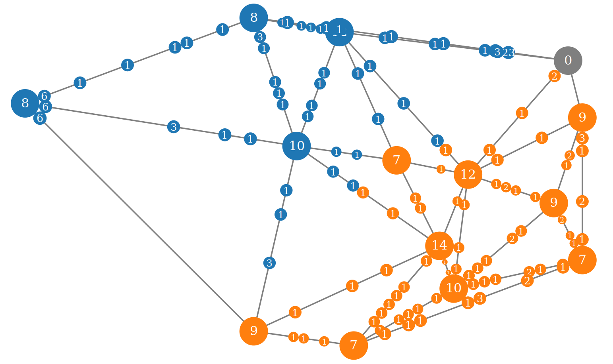

# BattleBots

## For participants

You can review
[the presentation](https://docs.google.com/presentation/d/1Y3DMxwDXzszvYDkskC_Oc7U0f_HSdA7zRcnfjHp4ypI/edit?usp=sharing)
of the kick-off event if you want.

If you just want to start coding, you can read the protocols and how to test
your bot [here](https://zeus.ugent.be/battlebots/rules).





## Rules

The playing field consists of a planar graph, where nodes are forts and edges
are roads. The goal of the game is to defeat your opponents by capturing all
their forts and defeating all their armies.

Each fort has its own garrison. These soldiers can be sent to march over a road
towards another fort. When two hostile armies meet, they will fight. Fights will
be resolved by substracting the smaller army from the larger, of which the
(optional) remainder marches on. When armies arrive at a fort, they will
reinforce the garrison if it is friendly, or fight it when it is hostile. When
multiple armies arrive at a fort, they will be grouped by player. Then, the size
of the smallest army will be subtracted from all armies, until only one army
remains. This army will then capture the fort. When all armies are defeated, the
original owner will remain in control of the fort. At the end of each turn, the
garrison of forts controlled by a player is increased by one.

The game is turn-based, and turns happen simultaneously. Each turn, each player
will be told the map state. He may then command his soldiers. Soldiers
garrisoned in a fort may be issued to march to another fort. Marching armies
cannot be commanded.

At the beginning of the game, each player owns one fort with a hundred soldiers.

## Description of internal state

The internal state consists of players (and their bots processes) and the
playing field.

A player has a unique name.

A playing field consists of a graph. For each node in the graph, the position
in an orthogonal coordinate system, the amount of armies and their alliances,
and the neighbouring nodes are stored. For each edge in the graph, any
wandering armies and their positions are stored.

## Interface to Bots

At the start of the game, the bot is told about the amount of armies in his
home base, located at (from viewpoint of the bot) the origin of the coordinate
system.

Upon occupying a new node (including the home base at the start of the game),
the bot is told about all edges adjacent to the new node. This of course
includes the position of the node "at the other end" of these edges.

At the beginning of each iteration, the bot is told about the locations of all
armies in his line of sight. The line of sight of a bot consists of:
- All nodes currently occupied by the bot;
- All neighbouring nodes of the nodes currently occupied by the bot;
- All edges interconnecting above nodes.

In case of an army located in a node, the bot is told about the size of this
army. For an army located on an edge, the bot is told about the direction and
the position (as a ratio of the edge) of the army.

## Protocol
For clarity: comments and ellipses are not part of the protocol :-)

    20 forts:
    # fort xcoord ycoord owner armysize
    boyard 10 20 felix 100
    helsingor 20 10 ilion 200
    nox 30 30 neutral 0
    ...
    10 roads:
    # fort1 fort2
    boyard helsingor
    helsingor nox
    ...
    50 marches:
    # origin destination owner size remaining_steps
    boyard helsingor felix 100 2
    helsingor boyard ilion 10 3
    ...

## Internal loop

After receiving new commands from the bots, the armies are moved in the following order:
- All armies on the move (including those just ordered to move) are moved half a position on their edges.
- Colliding armies are resolved.
- All (remaining) armies are moved the second half of their movement.
- Colliding armies are resolved.

Colliding armies behave as follows:
- Armies of the same alliance ignore each other.
- Armies of different alliance annihilate each other. TODO

## How it all fits together


    +---------------+
    |               |
    |   +-------+   |
    |   |       |   |
    |   |  Bot  |   |
    |   |       |   |
    |   +-------+   |                                   +-----------------+
    |               |                                   |                 |
    |    Sandbox    |                                   |     Website     |
    |               |                                   |                 |
    +---------+-----+                                   +------+----------+
            ^                                                  |
            |                                                  |
            |                                                  v
    +-------+-----+           +-------------+           +------+--------+
    |             |           |             |           |               |
    |   Arbiter   +<----------+    Ranker   +---------->+   Datastore   |
    |             |           |             |           |               |
    +-------+-----+           +-------------+           +---------------+
            |
            |
            v
    +---------+-----+
    |               |
    |    Sandbox    |
    |               |
    |   +-------+   |
    |   |       |   |
    |   |  Bot  |   |
    |   |       |   |
    |   +-------+   |
    |               |
    +---------------+

## How to generate test files
Run the following:
```
python battlebots/arbiter/arbiter.py test.json
```
